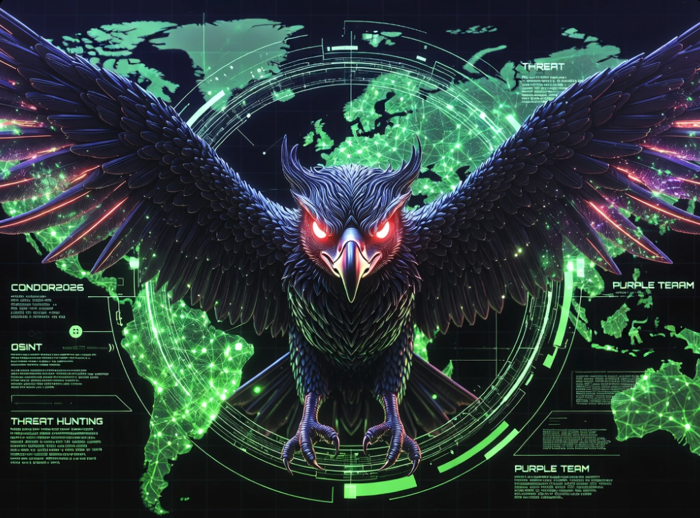

  

  

| Purple Team | OSINT Developer | Threat Hunter | Osinter | The Tracker | Threat Malware | Threat Intel | 🛡️ Consulting Cyber Security

> *"Knowing the enemy is the first step to defending yourself."*

**OSINT Analyst & Digital Threat Hunter**  
Research · Intelligence · Developer · Victim Support

---

## 🛡️ Threat Intelligence as a Service (TIaaS)

«I provide customized Cyber Threat Intelligence services for organizations, researchers, and security teams.»

> *"Independent threat and OSINT researcher • Soon SpectrumSecurity / Formal company"*

- Custom intelligence reports available upon request.

---

## 🔍 Services

| Service | Description |
|---------|-------------|
| 🔍 Threat Intelligence monitoring | Continuous threat monitoring |
| 🎣 Phishing campaign analysis | Phishing campaign analysis and tracking |
| 👤 Threat actor profiling | Profiling of threat actors and groups |
| 🌐 OSINT investigations | Custom OSINT investigations |
| 📊 Executive and technical intelligence reports | Tailored executive and technical reports |
| 🤖 Python automation for CTI and OSINT | Python automation for CTI/OSINT workflows |
| ⚡ IOC collection and enrichment | IOC collection, enrichment, and correlation |
| 🛠️ Custom security tools development | Development of custom security tools |
| 📡 Continuous monitoring of cybercriminal ecosystems | Monitoring of criminal ecosystems |
| 🛡️ Consulting Security | Security consulting services |

---

## 🛠️ Technologies

`Python` · `OSINT` · `CTI` · `Flask` · `APIs` · `Automation` · `MITRE ATT&CK` · `Git` · `Linux`

---

## 💼 Available for

- Freelance projects
- Consulting
- Security research
- Custom software development
- Remote collaboration

---

## 📫 Contact (professional only, encrypted)

| Channel | Handle |
|---------|--------|
| **⌲🌐 Telegram** | `Private` |
| **𝕏 Twitter** | `@PurpleCondors` | `@Panda_Sec_Intel`
| **☣️ VirusTotal** | `@KiraSecurity` |
| **📧 Email** | `KiraSecuruty@proton.me` |
| **💼 LinkedIn** | `never` |
| **💼 Freelancer** | `@condor2026ghost` |
| **💼 Fiverr** | `@elcondor2026` |

### ☕ Crypto Donations

- **ETH:** `0x8eEA6C4B77DaB2C20E632407065c4F5d93093EaA`
- **BTC:** `bc1qfvmwav55r3fqk88duux70z37kqw05c4k9t7h0j`
- **ETH (and USDC/USDT):** | USD | ETC | BTC
- 
# Operational Security Notice

For operational security reasons (active work on pro-Russian threat actors), I maintain anonymity until formal interest is expressed and an NDA or contract is signed.

Real personal data will only be provided once the company demonstrates serious interest and I consider it safe to do so.

**Policy:** `I do not sell data. I do not share Andrómeda. I do not SELL Andrómeda. I only share results through ethical collaborations with legitimate entities (SOCs, CSIRTs, governments, NGOs).`

---

## 🧬 Origin

I started in the security world as an independent researcher in hostile environments.  
Over time, I transformed that knowledge into mass prevention tools.  
Today I monitor persistent threat groups, build early detection systems, and publish actionable intelligence.  
My past taught me what no course can teach: how the enemy thinks and acts.

Self-taught, extreme opsec, creator of **Andrómeda** (private counter-intelligence system) and **Nebula** (public demo).  
I specialize in botnet detection, pro-Russian group tracking, DDoS infrastructure mapping, and persistent threat analysis.

---

## 🔍 Areas of Interest

`Threat Intelligence` · `Passive OSINT` · `Pro-Russian group analysis` · `Killnet/NoName tracking` · `LATAM organized crime` · `DDoS infrastructure mapping` · `Mass scraping` · `Actor attribution` · `Scanning prevention` · `Botnet monitoring` · `Defensive social engineering` · `Intelligence dashboards` · `Cyber Crime Analytics` · `Osinter` · `Hunter`

---

## 🔍 Analysis

| Area | Description |
|------|-------------|
| **Pro-Russian groups** | Active tracking of Killnet, NoName057(16), DarkStorm, RootSec, Electus, BotnetKingdom. DDoS infrastructure and TTP mapping. |
| **Organized crime in LATAM and Spain** | Analysis of drug trafficking, extortion, homicides, and gender violence patterns using passive OSINT on digital press (Diabolic suite). |
| **Malicious infrastructure** | Domain, IP, SSL certificate, WHOIS, JARM analysis, and IOC correlation for actor attribution (ShinyHunters, LAPSUS$, etc.). |
| **Advanced OSINT** | Mass scraping of Telegram, Discord, digital press, and forums. Geolocation, digital footprint, public data correlation. |
| **Threat prevention** | Early warning systems (Andrómeda) and monitoring dashboards for botnets and aggressive scanning (Nebula). |
| **Defensive social engineering** | Phishing attack detection and simulation for training and reporting of serious crimes (pedophilia, terrorism). |

| Role / Area | Description |
|-------------|-------------|
| **🔍 Threat Intelligence Analyst** | Monitoring, analysis and reporting of actors and campaigns (APT, hacktivism, organized crime). |
| **🛡️ Purple Team / Threat Hunter** | Proactive detection, IoC correlation, adversary emulation and defense improvement. |
| **🌐 OSINT Investigator** | Digital footprint, profiles, infrastructures and geolocation investigations for legal or corporate cases. |
| **🤖 Automation Developer (CTI/OSINT)** | Scraper development, dashboards, API integration and ETL flows for intelligence. |
| **📊 Cybercrime Analyst** | Analysis of criminal patterns in LATAM, Europe and Spanish-speaking environments. |
| **🧠 Security Consultant / Advisor** | Strategic cyber defense advisory, risk management and incident response. |

## 🛠️ Technologies & Tools

| Category | Technologies |
|----------|--------------|
| **Languages** |       |
| **IDE / Environments** |   |
| **OSINT / Security** |            |
| **Threat Intelligence** |        |
| **Scraping / Automation** |       |
| **Web / Visualization** |        |
| **Databases** |     |
| **Version Control** |    |
| **Environments / OS** |        |
| **OSINT Platforms** |        |
| **Knowledge Domains** |     |
| **Methodologies** | `MITRE ATT&CK` · `TTPs` · `IoCs` · `Purple Team` · `Threat Hunting` · `Threat Intelligence` · `Passive OSINT` · `Cyber Crime Analytics` · `DevOps` · `CI/CD Pipelines` · `Diamond Model` · `Cyber Kill Chain` · `Intelligence Driven Defense` |
| **Other Specializations** | `DDoS Tracking` · `Botnet Detection` · `Malware Analysis` · `Phishing Analysis` · `Social Engineering Defense` · `Fraud Detection` · `Crime Analysis` · `Investigative Journalism` · `Victim Support` · `Threat Actor Profiling` · `Takedown Coordination` |

---

## 🧠 Methodologies & Practices

`MITRE ATT&CK` · `TTPs` · `IoCs` · `Purple Team` · `Threat Hunting` · `Threat Intelligence` · `Passive OSINT` · `Cyber Crime Analytics` · `DevOps` · `CI/CD Pipelines`

---

## 📊 GitHub Activity (Real-time)

---

## 📈 General Statistics

*Coming soon*

---

## 🔥 Featured Projects

| Project | Brief Description | Status |
|---------|-------------------|--------|
| **[📄 cti-xv-dpx](https://github.com/Condor2026/cti-xv-dpx)** | Complete CTI dossier on X-VDP-X (diable'fire) and the France Cyber Défense breach. Includes TTP analysis, IOCs, and French legal framework. | ✅ Public |
| **[🌌 Nebula AntiScan](https://github.com/Condor2026/Nebula_AntiScan2)** | Public demo: aggressive scan detection, Killnet IPs, and botnets. Cyberpunk dashboard with 73 OSINT sources + 80 intelligence feeds. | ✅ Public |
| **[🇪🇸 Diabolic Peninsular](https://github.com/Condor2026/Diabolic_Peninsular_V17)** | Analytical OSINT for Spanish peninsular press: detection of criminal patterns. | ✅ Public |
| **[🇪🇸 Diabolic Baleares](https://github.com/Condor2026/Diabolic_v17)** | OSINT for Balearic Islands press (robberies, scams, drug trafficking). | ✅ Public |
| **[🇪🇸 Diabolic Canarias](https://github.com/Condor2026/Diabolic_Canarias)** | OSINT for Canary Islands press. | ✅ Public |
| **[🌎 Diabolic Latam](https://github.com/Condor2026/Diabolic_Latam)** | OSINT for detecting criminality in Latin America. | ✅ Public |
| **[🇮🇹 Diabolic Italia](https://github.com/Condor2026/Diabolic_It)** | Automated OSINT on 70+ Italian newspapers. | ✅ Public |
| **[🇫🇷 Diabolic France](https://github.com/Condor2026/diabolic_france)** | OSINT social aid platform - 30+ sources, 96 departments, 3 languages. | ✅ Public |
| **[🇮🇪 Keltic Kraken](https://github.com/Condor2026/keltic_kraken)** | Ireland Criminal Intelligence Platform - Monitoring Crime. | ✅ Public |
| **[🕵️ LYRA OSINT](https://github.com/Condor2026/Lyra_Osint)** | Public query tool for phones, emails, IPs, and usernames across 300+ platforms. | ✅ Public |
| **[🦅 TrueCall_Condor](https://github.com/Condor2026/TrueCall_Condor)** | OSINT tool for documenting scam calls, phishing domains, and fraudulent URLs. | ✅ Public |
| **[📡 Andrómeda](https://github.com/Condor2026/Andromeda-analisi-grupos-ciber-delictivos)** | Private counter-intelligence system (DDoS monitor, 3D map, botnets, +250k alerts). | 🔒 Private |
| **[📄 Dossier 764 & Gov.eth](https://github.com/Condor2026/Dossier-764-Gov.eth---Analisis-de-Ciberamenazas-Hibridas)** | Complete dossier on the 764 terrorist network and cybercriminal Gov.eth. | ✅ Public |
| **[🎣 Campaign Phishing AEAT](https://github.com/Condor2026/CAMPAIGN-DE-PHISHING-AEAT-Y-MALWARE-ASOCIADO)** | Analysis of mass phishing impersonating the Spanish Tax Agency. | ✅ Public |
| **[📄 CTI GLOBAL REPORT](https://github.com/Condor2026/INFORME-DE-INTELIGENCIA-DE-AMENAZAS-CIBERNETICAS-CTI-GLOBAL)** | Global analysis of cyberspace and the invisible war. | ✅ Public |
| **[📄 CTI RUSSIAN REPORT](https://github.com/Condor2026/INFORME-DE-INTELIGENCIA-DE-AMENAZAS-RUSAS-CIBERNTICAS-CTI-21-7-2026)** | Complete dossier on Russian cyber threats. | ✅ Public |
| **[📄 CIBERWAR: Pro-Russian Hacktivist Ecosystem](https://github.com/Condor2026/CIBERWAR-El-Ecosistema-Silencioso)** | Analysis of the pro-Russian hacktivist ecosystem. | ✅ Public |
| **[📄 Dead Man's Switch](https://github.com/Condor2026/Dead-Man-s-Switch)** | Digital will with a surprise. | ✅ Public |
| **[⚓ OCEANUS-AI v4.5](https://github.com/Condor2026/OCEANUS-AI-v4.5)** | Maritime monitoring system for Geo-routes (Anti-Narco boats) - private only. | 🔒 Private |
| **[🇩🇪 Diabolic Alemania](https://github.com/Condor2026/Diabolic_Alemania)** | OSINT for Germany. | ✅ Public |

---

## 🧠 Work Philosophy

- **Anonymity as a shield** – not as a weapon. I protect my identity to keep operating.
- **Open source for education** – tools like Nebula and Diabolic are public so you can learn.
- **Private intelligence for real defense** – Andrómeda is my capital and is not published.
- **Trust is earned through results** – not with certificates or posturing.

---

## 📜 Latest Updates

- `2026-07-23` – Publication of CTI dossier: X-VDP-X (diable'fire) / France Cyber Défense.
- `2026-07-23` – Profile update with new projects.
- `2026-06-04` – Nebula AntiScan v1.3 release (public).
- `2026-05-30` – Diabolic Peninsular v17 improvements.
- `2026-05-20` – Integration of 80 intelligence feeds into Andrómeda.

---

## 🛡️ Specialized Services

### · Person Investigation
Location, digital environment analysis, and collection of public evidence for legal complaints (harassment, scams, impersonation, fraud).

### · Cyberintelligence
Tracking of technical threats (malware, phishing, attack groups, malicious infrastructures).

### · Support for Lawyers and Victims
Structured reports with documentary validity, ready for use in legal proceedings.

---

## 📌 My Method

- **Advanced OSINT:** I select, discard, polish, and deliver clear evidence.
- **Hyperfocus and speed:** Where others take weeks, I deliver in days.
- **100% legal action:** Only open sources and public access. No hacking or illegal activities.

---

## ✅ Why trust me?

- Real experience in cyberintelligence and threat analysis.
- Collaborations with sector professionals (privacy, security, law).
- Reports designed for lawyers and victims to use without fear.

---

**🔍 Open to work** – Threat Intelligence, OSINT, Purple Team, Automation.  

**🤖 Custom Telegram bots for OSINT/CTI** available. 

  - Contact: `KiraSecuruty@proton.me` (PGP on request). 
  - No personal TG/LinkedIn for opsec.
---

> *"Those who talk don't do. I have done. And I keep doing. Alone."*

---

**maintained by:** condor 2026 threat security - andromeda private suite
🦅 **maintained by:** condor 2026 threat security - andromeda private suite - PURPLETEAM - Defense - StopCiberAttack - Prevention - Journalism - Threat Intelligence** 🦅

---

  

